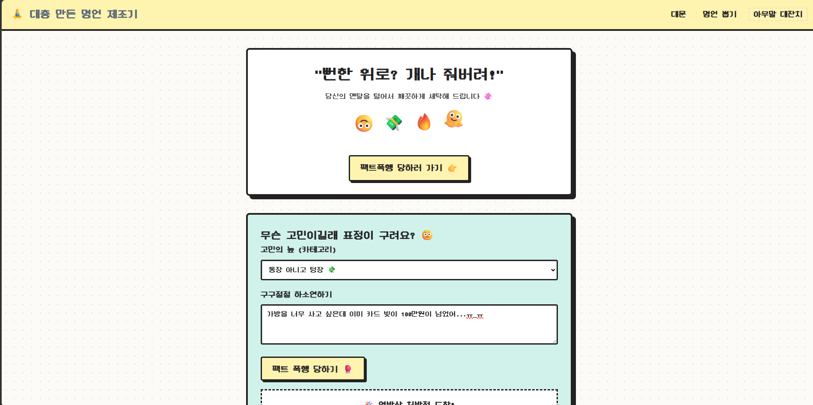
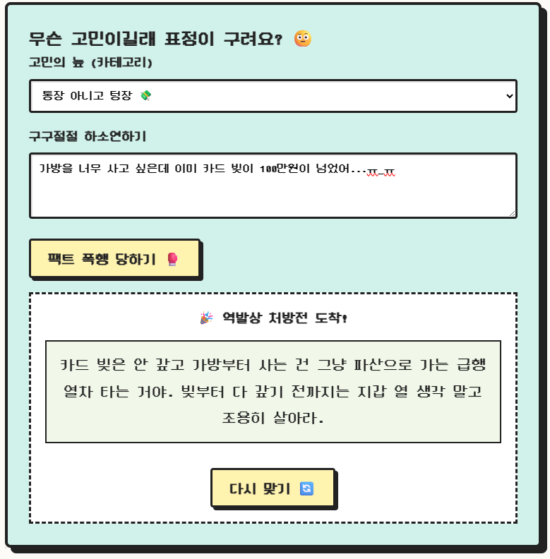
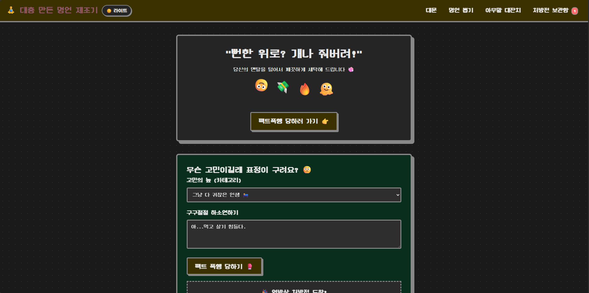
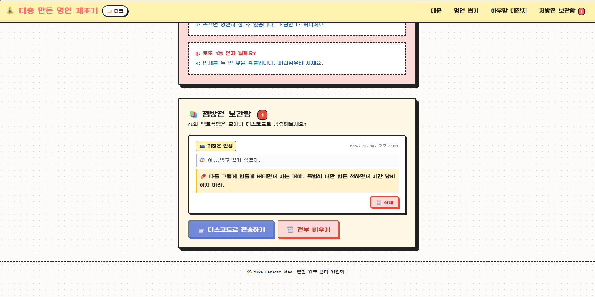
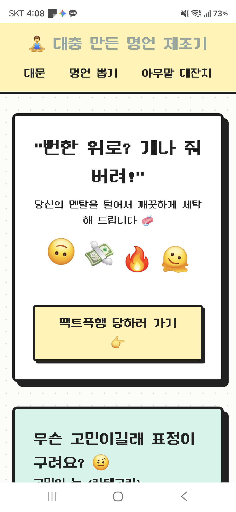
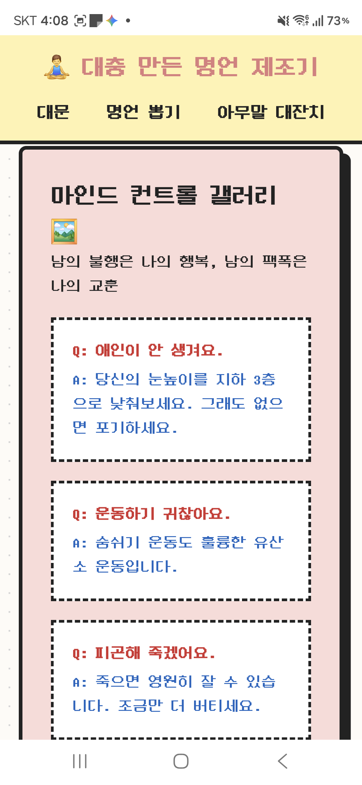
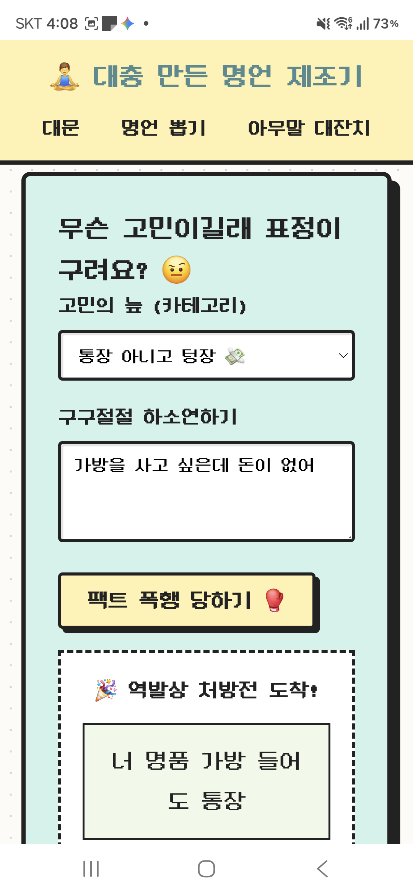
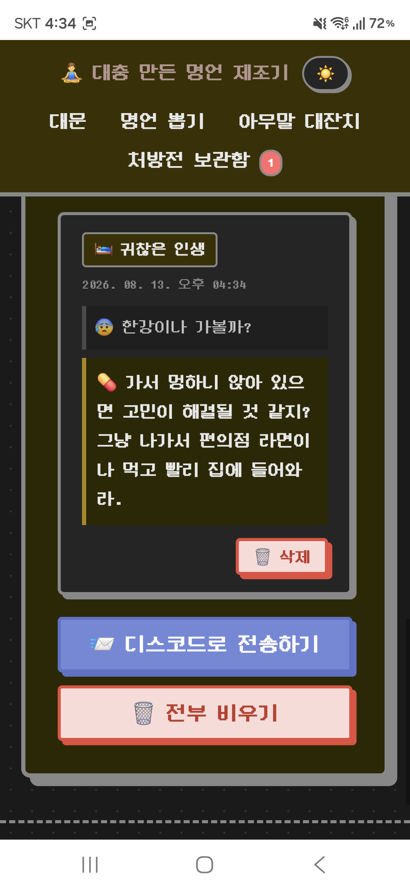
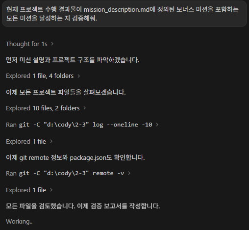
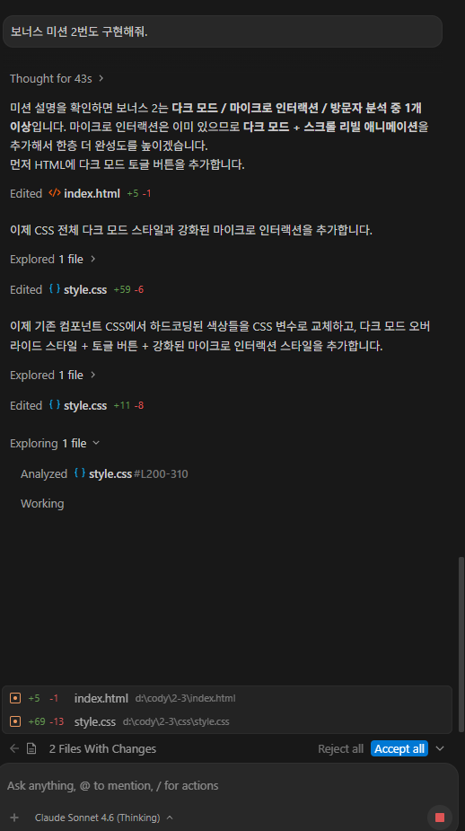

# 🧘‍♂️ Paradox Mind: B급 감성 '역발상 힐링' 명언 제조기

> **"뻔한 위로는 거부한다!"**  
> AI 코딩 도구를 활용하여 기획부터 바닐라 프론트엔드/파이썬 서버리스 백엔드 구현, Vercel 배포까지 전 과정을 직접 진행한 AI 연동 웹 서비스 프로젝트입니다.

---

## 📌 1. 서비스 소개 (Overview)

### 💡 기획 배경 및 목적
진부하고 상투적인 위로 한마디에 피로감을 느끼는 현대인들(학업, 직장, 금전, 인생 고민 등)을 위해, 뻔한 어설픈 따뜻함 대신 **B급 유머와 해학이 담긴 역발상 팩트폭행 명언**을 AI로 생성하여 헛웃음과 실소를 유발하고 무거웠던 마음을 가볍게 환기시켜 주는 힐링 웹 서비스입니다.

### 👥 타겟 사용자
- 시험 기간만 되면 온갖 딴짓이 재미있고 공부하기 싫은 학생 📚
- 텅장이 된 통장을 보며 매일 퇴사를 꿈꾸는 직장인 🏢💸
- 그냥 다 귀찮고 인생의 의욕이 잠시 꺾인 현대인 🛌

### 🔍 검증된 주요 서비스 섹션 목록
- **대문 (Hero)**: B급 레트로/키치 감성 디자인과 소개 헤드라인
- **명언기 (Generator)**: 고민 카테고리 선택 및 상세 고민 입력 후 AI 처방전 생성
- **갤러리 (Gallery)**: 남들의 해학과 유머가 담긴 짤막 명언 갤러리
- **보관함 (Archive)**: 생성된 처방전 카드 저장(LocalStorage) 및 디스코드 웹훅 공유

---

## 🛠️ 2. 기술 스택 & 기술별 역할 (Tech Stack & Roles)

본 프로젝트는 불필요한 프레임워크 오버헤드 없이 바닐라 웹 표준 기술과 파이썬 서버리스 함수를 활용해 구현되었습니다.

| 기술 구분 | 적용 기술 | 프로젝트 내 상세 역할 |
|---|---|---|
| **Frontend Structure** | `HTML5` | 시맨틱 태그 구조화, 페이지 레이아웃 뼈대 형성, 웹 접근성 및 메타데이터 제공 |
| **Frontend Style** | `CSS3` | Custom B급 레트로/키치 테마 CSS 작성, 반응형 미디어 쿼리(320px/768px/1024px+), 다크/라이트 테마 CSS 변수 관리 |
| **Frontend Logic** | `JavaScript (ES6+)` | DOM 동적 렌더링, 사용자 이벤트 핸들링, `fetch()` 비동기 API 통신, `LocalStorage` 기반 처방전 상태 관리 |
| **Backend Functions** | `Python 3.9` | Vercel Serverless Functions (`/api/generate.py`, `/api/discord.py`) 엔드포인트 구현, AI API 연동 및 데이터 검증 |
| **AI Integration** | `Gemini API` | 팩트폭행 페르소나 및 80자 제한 역발상 프롬프트 엔지니어링 수행 |
| **Infrastructure** | `Vercel` | GitHub 연동 CI/CD 자동화 배포, Serverless Functions 파이프라인 |

---

## 🏗️ 3. 아키텍처 및 프론트/백엔드 분리 사유

```
[ Client (Browser) ] ── (fetch API) ──> [ Vercel Serverless (Python) ] ──> [ Gemini AI / Discord ]
 (HTML/CSS/JS UI)                       (api/generate.py, discord.py)     (API Key Secure Call)
```

### 💡 프론트엔드와 백엔드를 분리한 사유
1. **보안성 (Security)**: LLM API Key 및 Discord Webhook URL을 클라이언트에 노출하지 않고 백엔드 환경 변수로 안전하게 은닉하기 위함입니다.
2. **배포 및 확장 독립성 (Scalability)**: 정적 UI 리소스는 CDN을 통해 초고속 제공하고, AI 계산 및 외부 통신 로직은 Vercel Serverless Function으로 필요할 때만 독립적으로 호출·확장합니다.
3. **유지보수성 (Maintainability)**: UI 변경(HTML/CSS/JS)과 비즈니스 로직(AI 프롬프트 및 API 파이프라인)의 관심사를 분리(SoC)하여 향후 백엔드 AI 모델 변경 시 프론트엔드 코드 영향도를 최소화합니다.

---

## 🔄 4. 비동기 데이터 흐름 (fetch Workflow) & API 명세

### 🌊 비동기 호출 및 상태 전환 흐름
1. **사용자 입력**: 카테고리 선택 및 고민 입력 폼 제출 (`worry-form`)
2. **비동기 요청**: `js/api.js`에서 `fetch('/api/generate', { method: 'POST', body: JSON.stringify(...) })` 실행
3. **UI 상태 전환 (로딩)**: 로딩 애니메이션 노출 (`loading.classList.remove('hidden')`), 제출 버튼 비활성화
4. **서버리스 처리**: Python 백엔드가 입력 검증 후 Gemini API 호출하여 AI 역발상 명언 생성
5. **JSON 응답 & DOM 업데이트 (성공/실패)**:
   - **성공 시**: 로딩 숨김, 처방전 카드 렌더링, 저장 버튼 활성화
   - **실패 시**: 타임아웃(15초) 또는 API 에러 안내 메시지 출력 후 UI 복구

### 📝 API 요청/응답 JSON 스키마 예시

#### 1) AI 명언 생성 (`POST /api/generate`)
- **Request Body**:
```json
{
  "category": "work",
  "text": "월요일 아침마다 회사 가기가 너무 귀찮고 힘들어요."
}
```
- **Response Body (200 OK)**:
```json
{
  "quote": "회사도 당신이 오길 썩 기다리지 않을 겁니다. 무승부니 편하게 생각하세요!"
}
```
- **Error Response (400 Bad Request / 500 Error)**:
```json
{
  "error": "잘못된 요청: 고민 내용(text)이 비어있습니다."
}
```

#### 2) 디스코드 전송 (`POST /api/discord`)
- **Request Body**:
```json
{
  "items": [
    {
      "id": 1723539000000,
      "category": "work",
      "worry": "월요일 아침마다 회사 가기 싫어요",
      "quote": "회사도 당신을 기다리지 않습니다.",
      "date": "2026. 08. 13. 오후 4:30"
    }
  ]
}
```
- **Response Body (200 OK)**:
```json
{
  "success": true,
  "sent": 1
}
```

---

## 🤖 5. AI 프롬프트 설계 의도 & 실제 입출력 테스트 사례

### 🎯 프롬프트 설계 의도 (`api/generate.py`)
- **페르소나 설정**: 10년지기 팩폭 친구 역할 부여
- **핵심 규칙**:
  1. 분량: 80자 이내 짧은 2문장 (서론/사족/훈계 금지)
  2. 톤앤매너: 찰진 반말(~거야, ~다, ~해라), 유명 명언 스타일의 역설적 유머 적용
  3. 실패 UX 방지: 정형화된 JSON(`{"quote": "..."}`) 형식으로만 반환

### 🧪 실제 테스트 케이스 (Test Cases)
- **정상 입력**: "오늘 할 일을 내일로 미루고 싶어요" ➔ *"미룰 수 있을 때 미루는 것도 능력이다. 내일의 당신이 더 잘할 수도 있다."*
- **빈 입력 예외**: `""` 제출 ➔ *"입력란이 너무 허전하네요! 고민을 적어주셔야 해결책도 나옵니다."* 경고 창 안내
- **긴 입력**: 300자 이상 하소연 ➔ 서버 단에서 300자로 슬라이스 후 정상 처리

---

## ⚡ 6. 지연(Latency) 완화 및 성능 개선 방안

1. **고속 경량 모델 채택**: 응답 속도가 빠른 `gemini-3.1-flash-lite` 및 `gemini-3.5-flash-lite` 모델을 적용하여 생성 지연 시간 및 비용 최소화.
2. **프롬프트 최적화**: 토큰 소비를 줄이고 지연을 감소시키기 위해 80자 이내 출력 제약 조건 적용.
3. **클라이언트 타임아웃 & AbortController**: `fetch` 요청 시 15초 타임아웃을 설정하여 무한 대기 현상 방지 및 사용자 안내.
4. **로컬 캐싱**: 생성된 명언을 `LocalStorage`에 저장하여 재방문 시 무분별한 백엔드 API 재호출 방지.

---

## 🚨 7. 배포 문제 진단 및 재배포 가이드

### 🔍 문제 발생 시 진단 방법
1. **Vercel Serverless Function 에러 확인**:
   - Vercel Dashboard ➔ 프로젝트 선택 ➔ **Logs** / **Functions** 탭 진단 (HTTP 500, Key 오류 등 확인)
2. **클라이언트 에러 확인**:
   - 브라우저 개발자 도구 (F12) ➔ **Console** (JS 에러) 및 **Network** (fetch Status Code) 확인

### 🔄 재배포 절차 (Redeploy)
- **Git Push 트리거**: 코드 수정 후 `git commit -m "fix: ..." && git push origin main` 실행 시 Vercel 자동 재배포.
- **수동 재배포**: Vercel Dashboard ➔ **Deployments** ➔ 대상 배포 항목의 `...` 메뉴 ➔ **Redeploy** 클릭.

---

## 📊 8. 프레임워크(React/Next.js 등) 도입 비교 분석

순수 바닐라 구현 방식과 프레임워크 도입 시의 장단점 및 변경 범위를 비교한 결과입니다.

| 구분 | 바닐라 (현재 구현) | 프레임워크 (React / Next.js) |
|---|---|---|
| **장점** | - 번들 사이즈 0KB, 초고속 로딩<br>- 빌드 단계 없음<br>- 브라우저 표준에 직접 동작 | - 컴포넌트 재사용성 및 상태 관리 용이 (`useState`)<br>- SSR/SSG 지원으로 SEO 극대화<br>- 풍부한 생태계 |
| **단점** | - 규모 증가 시 DOM 직접 조작 복잡도 증가<br>- 컴포넌트 분리 한계 | - 빌드 도구(Vite/Webpack) 필요<br>- 번들 용량 증가 및 초기 로딩 오버헤드 |
| **변경 범위** | N/A (현재 상태) | - `index.html` ➔ JSX 컴포넌트 구조로 전면 리팩토링<br>- `LocalStorage` 및 state 훅 전환<br>- Package.json 빌드 스크립트 작성 |

---

## 🔒 9. 환경 변수 관리 & 키 유출 대응 프로세스

### 🔑 로컬 테스트 및 환경 변수 설정
1. 프로젝트 루트의 `.env.example` 파일을 복사하여 `.env` 파일을 생성합니다.
2. `GEMINI_API_KEY` 및 `DISCORD_WEBHOOK_URL` 값을 입력합니다.
3. `.gitignore`에 `.env`가 등록되어 있으므로 Git에 커밋되지 않습니다.

### 🌐 Vercel 운영 환경 변수 관리
- Vercel Settings ➔ **Environment Variables**에서 Production, Preview, Development 별로 환경 변수를 다르게 지정하여 안정성을 확보합니다.

### 🚨 API 키 유출 시 대응 절차
1. **즉시 키 폐기**: Google AI Studio 또는 Discord 설정 대시보드에서 유출된 Key/Webhook URL 즉시 삭제 및 재발급.
2. **Vercel 변수 갱신**: Vercel Environment Variables의 키 값을 재발급받은 신규 키로 즉시 변경 후 Redeploy.
3. **Git 커밋 이력 정리**:
   - `git filter-repo` 또는 `BFG Repo-Cleaner` 도구를 사용하여 과거 커밋 이력에서 유출된 키 완벽 제거:
     ```bash
     npx bfg --replace-text passwords.txt
     git reflog expire --expire=now --all && git gc --prune=now --force
     git push origin --force --all
     ```

---

## 🌐 10. 배포 및 실행 안내

### 🔗 배포 URL
- **Vercel 라이브 서비스**: [https://2-3-1-ruddy.vercel.app/](https://2-3-1-ruddy.vercel.app/)

### 💻 로컬 실행 방법
1. 저장소 클론: `git clone https://github.com/gigantess/2-3.git`
2. 환경 변수 설정: `.env.example`을 복사하여 `.env` 작성
3. 백엔드 패키지 설치: `pip install -r api/requirements.txt`
4. 프론트엔드 실행: VSCode Live Server 등을 활용해 `index.html` 오픈

---

## 🎯 11. 미션 달성 체크리스트 (19/19 항목 100% 반영)

- [x] **#1 배포 URL 및 상단 네비게이션**: Vercel 배포 완료 및 4개 검증 섹션 제공
- [x] **#2 반응형 미디어쿼리**: 320px, 768px, 1024px+ 반응형 레이아웃 확인
- [x] **#3 JSON API 연동**: POST fetch ➔ Python Serverless ➔ AI JSON 응답 처리
- [x] **#4 정상/예외 입력 테스트**: 정상, 빈 값, 긴 문장 입력 테스트 완료
- [x] **#5 UX 예외 안내**: 빈 입력, 타임아웃, API 에러 안내 메시지 적용
- [x] **#6 환경 변수 보안**: `.env.example` 작성 및 소스 내 API 키 노출 금지 정책 적용
- [x] **#7 제출 패키지 구성**: 배포 URL, README, 기획서, 스크린샷 캡쳐본 일체 포함
- [x] **#8 프론트/백엔드 분리 사유**: 보안, 배포 독립성, 유지보수성 관점 서술 완료
- [x] **#9 상태 전환 흐름**: 로딩 ➔ 성공 ➔ 실패 상태 및 변수 관리 정리
- [x] **#10 API 요청/응답 명세**: JSON 스키마 예시 명시
- [x] **#11 배포 진단 및 재배포 절차**: Vercel Logs, DevTools 콘솔 진단 및 Redeploy 절차 작성
- [x] **#12 HTML/CSS/JS 역할**: 각 표준 기술의 프로젝트 내 역할 서술 완료
- [x] **#13 fetch 비동기 흐름도**: 클라이언트 ➔ 서버리스 ➔ DOM 렌더링 서면 명시
- [x] **#14 환경 변수 관리 팁**: Production/Preview/Development 격리 관리 설명
- [x] **#15 AI 프롬프트 설계 의도**: 팩폭 페르소나 및 80자 제한 규칙 작성
- [x] **#16 지연 완화 전략**: 경량 모델, 타임아웃, 프롬프트 압축, 캐싱 전략 기술
- [x] **#17 확장 설계**: 추가 API 및 프론트 위젯 확장 가능성 언급
- [x] **#18 API 키 유출 조치**: Key 폐기, Vercel 갱신, Git filter-repo 명령어 가이드 제공
- [x] **#19 프레임워크 비교 분석**: 바닐라 vs React/Next.js 장단점 및 변경 범위 표 정리

---

## 📄 12. 증빙 자료 및 제출 패키지 (Evidence & Deliverables)

### 📁 1. 제출 패키지 경로 요약
- **서비스 기획서**: [`./doc/SERVICE_PLAN.md`](./doc/SERVICE_PLAN.md)
- **환경 변수 샘플**: [`./.env.example`](./.env.example)
- **스크린샷 폴더**: [`./screenshot/`](./screenshot/)

### 🖼️ 2. 스크린샷 캡쳐본

#### 🖥️ 데스크톱 화면 (반응형 1024px+)
| 메인 Hero 화면 | AI 처방전 생성 화면 |
|---|---|
|  |  |

| 다크모드 적용 화면 | 처방전 보관함 화면 |
|---|---|
|  |  |

#### 📱 모바일 반응형 화면 (320px / 768px)
| 모바일 메인 | 모바일 서브 | 모바일 AI 동작 |
|---|---|---|
|  |  |  |

| 모바일 다크모드 | 모바일 처방전 보관함 |
|---|---|
|  |  |

#### 🤖 AI 에이전트 도구 활용 증빙
- AI 코딩 도구 대화 및 코드 생성 과정 스크린샷



#### 🤖 vercel 배포 목록

